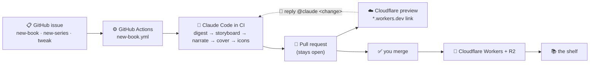

<h1 align="center">orly 📚</h1>

<p align="center"><a href="README.md">English</a> · <a href="README.zh-CN.md">简体中文</a> · 日本語</p>

<p align="center">
  <em>生成された解説書を自ら増やしていく本棚。</em><br/>
  Claude Code に任意の GitHub リポジトリとそのサブシステムを指定すると、ナレーションとアニメーション付きの
  <strong>O'RLY パロディー</strong>「本」を作成し、本棚へ公開します。
</p>

<p align="center">
  <a href="https://github.com/BLamy/orly/actions/workflows/deploy.yml"></a>
  <a href="https://orly.brett-lamy.workers.dev/"></a>
  <a href="https://claude.com/claude-code"></a>
  <a href="LICENSE"></a>
</p>

<p align="center">
  <a href="https://orly.brett-lamy.workers.dev/?bundle=the-orly-loop">
    
  </a>
</p>

> ### ▶ このリポジトリを解説するエクスプレイナーを見る
> **[ORLY Loop →](https://orly.brett-lamy.workers.dev/?bundle=the-orly-loop)** — 本棚が自身について生成した一冊です。Issue を開く → Claude Code が本を作る → プレビュー PR → `@claude` で調整 → マージ → 公開、という流れを紹介します。このプロジェクトを理解する最短の方法は、これを見ることです。

**公開中の本棚：** **https://orly.brett-lamy.workers.dev/**

---

## 「本」とは？

各本は、コードベース内のあるサブシステムについて、ナレーションとアニメーションで示す**データフロー解説**です。

- 複数章からなる **D3 スライドショー** — 時間とともに組み上がるノードとエッジ、アニメーションするメッセージパケット、各ステップを捉えるカメラ。
- ElevenLabs による**ナレーション**。文字単位の正確な TTS タイムスタンプを使って、スライドを音声に同期します。
- **O'RLY パロディーの表紙** — `gpt-image` による木版画風の動物（文字を拒否する QA ループで検査）を、ブラウザー内でタイトルと著者名に合成し、本棚上の 3D 本へ傾けて配置します。
- **実際のコードに基づく内容** — ストーリーボードは実在するファイルや関数を参照し、何も捏造しません。

現在、本棚には *Effect.ts — The Good Parts* シリーズ全編を含む **8 冊**があります。

## ループの仕組み

本を追加するためにファイルを編集する必要はありません。**Issue を開く**だけで、残りは CI が処理します。



1. テンプレートから Issue（📕 新しい本、📚 新しいシリーズ、✏️ 調整）を開きます。誰でも Issue を作成できますが、処理が実行されるのはリポジトリ所有者が開いた場合、または `build` ラベルを付けた場合だけです。ラベルを付け直すと再実行できます。
2. **Claude Code が CI 内で実行**され、[`.claude/commands/`](.claude/commands) にある対応する手順書に従って、ジェネレーターを最初から最後まで動かします。
3. **プルリクエスト**が開かれたまま作成され、実際に動く **Cloudflare プレビュー**へのリンクが PR にコメントされます。
4. PR に **`@claude <change>`** と返信すると本を修正できます。ブランチを編集・プッシュし、プレビューを再デプロイします。必要なだけ繰り返せます。
5. **あなたがマージ**します。意図的に残された唯一の手動ステップであり、その後 **Cloudflare Workers** へデプロイされます。

## フォークして自分用に動かす

リポジトリをフォークしていくつかのシークレットを追加すれば、同じループで自分のコレクションを構築できます。

| シークレット | 役割 | 入手先 |
| --- | --- | --- |
| `CLAUDE_CODE_OAUTH_TOKEN` | CI で Claude Code を実行 — 呼び出しごとの API キーではなく、**Claude サブスクリプションに課金** | **`claude setup-token`** を実行 |
| `CLOUDFLARE_API_TOKEN` + `CLOUDFLARE_ACCOUNT_ID` | 本番デプロイと PR ごとのプレビュー | Cloudflare ダッシュボード →「Edit Cloudflare Workers」トークン |
| `OPENAI_API_KEY` | `gpt-image` による表紙画像 | platform.openai.com |
| `ELEVENLABS_API_KEY` | ナレーションのテキスト読み上げ | elevenlabs.io |
| `NOUN_PROJECT_KEY` + `NOUN_PROJECT_SECRET` | 図のノードやパケット用アイコン | thenounproject.com/developers |

次に、フォーク上で **📕 New book** Issue を開き、プレビュー PR が表示されるのを待つだけです。

> **ホスティング：** 本棚は静的アセットの **Cloudflare Worker**（`wrangler.jsonc`）で、ドメインのルートから配信されます。`deploy.yml` は `main` を本番環境へ、`preview.yml` は各本の PR を `*.workers.dev` プレビューへデプロイします。（メディアファイル — MP3 と表紙 — は現在バンドルされていますが、将来は **R2** オブジェクトストレージから配信する予定です。）

## ローカルで本を作る

Issue フローだけでなく、ローカル環境からジェネレーターを直接動かすこともできます。

```bash
npm install            # also installs the git pre-commit hooks
npm run dev            # http://localhost:5173/  (the shelf)

# generate a book (or run /new-book inside Claude Code):
npm run explain -- --repo https://github.com/koajs/koa \
                   --prompt "how a request flows through the middleware onion" \
                   --title "Koa.js" --open
```

キーは git に無視される `.env` に保存します（`OPENAI_API_KEY`、`ELEVENLABS_API_KEY`、`NOUN_PROJECT_KEY/SECRET`）。ストーリーボードは Claude Code が作成するため、Anthropic API キーは不要です。パイプライン全体については [`generator/README.md`](generator/README.md)、手順書については [`.claude/commands/`](.claude/commands) を参照してください。

## アーキテクチャ

```
generator/   the pipeline (npm run explain)
  repo.mjs · storyboard.mjs · validate.mjs (layered layout) · tts.mjs (ElevenLabs)
  cover.mjs + seeds.mjs (gpt-image + vision QA) · noun.mjs + iconize.mjs · transform.mjs
src/         the Vite + React app
  library/   the iBooks-style shelf (canvas 3-D books)
  engine/    the D3 slideshow (audio-synced, icon-aware)
public/generated/<slug>/   each book's manifest.json + audio/ + animal.png
  library.json             the shelf registry
.github/workflows/         deploy · new-book · preview · comment-edit · test-pipeline
```

**技術：** Vite · React · D3 · Framer Motion · Cloudflare Workers · ElevenLabs · OpenAI `gpt-image` · The Noun Project · GitHub Actions · Claude Code。

## クレジットと免責事項

アイコンは [The Noun Project](https://thenounproject.com)（CC BY）を使用しています。表紙は **「O'RLY?」のパロディー**です。本プロジェクトは **O'Reilly Media と提携しておらず、同社の承認も受けていません**。また、実在する出版社名を表紙に表示することはありません。

[Claude Code](https://claude.com/claude-code) と GitHub Actions ワークフローを使用して構築されています。

## ライセンス

[MIT](LICENSE) © Brett Lamy
