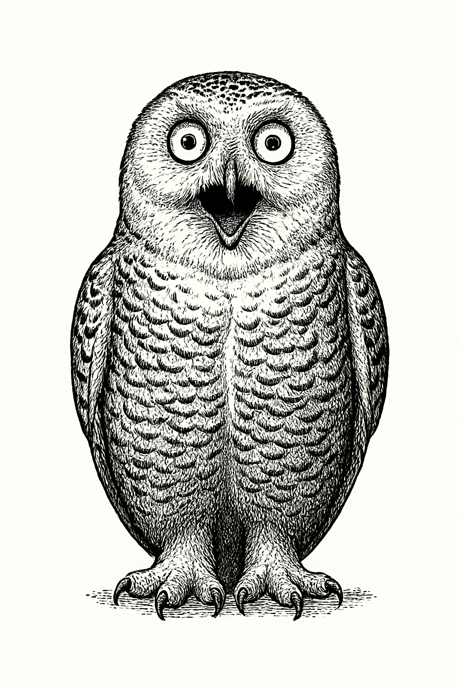
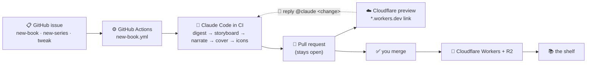

<h1 align="center">orly 📚</h1>

<p align="center">
  <em>A self-building bookshelf of generated explainers.</em><br/>
  Point Claude Code at any GitHub repo + a subsystem, and it writes a narrated,
  animated <strong>O'RLY-parody</strong> "book" — then ships it to the shelf.
</p>

<p align="center">
  <a href="https://github.com/BLamy/orly/actions/workflows/deploy.yml"></a>
  <a href="https://orly.brett-lamy.workers.dev/"></a>
  <a href="https://claude.com/claude-code"></a>
  <a href="LICENSE"></a>
</p>

<p align="center">
  <a href="https://orly.brett-lamy.workers.dev/?bundle=the-book-machine">
    
  </a>
</p>

> ### ▶ Watch the explainer that explains this repo
> **[ORLY Loop →](https://orly.brett-lamy.workers.dev/?bundle=the-book-machine)** — a book the shelf generated *about itself*: open an issue → Claude Code builds the book → a preview PR → `@claude` tweaks → you merge → it's live. The fastest way to understand this project is to watch it.

**Live shelf:** **https://orly.brett-lamy.workers.dev/**

---

## What's a "book"?

Each book is a narrated, animated **data-flow explainer** of one subsystem of some codebase:

- A multi-chapter **D3 slideshow** — nodes and edges that build up over time, animated message packets, a camera that frames each step.
- **Narration** by ElevenLabs, with slides synced to the audio via exact per-character TTS timestamps.
- An **O'RLY-parody cover** — a `gpt-image` woodcut animal (text-rejecting QA loop), composited in-browser with the title/author and skewed onto a 3-D book on the shelf.
- **Grounded in real code** — the storyboard step cites real files/functions; nothing is invented.

There are **8 books on the shelf** today, including a whole *Effect.ts — The Good Parts* series.

## How the loop works

You never edit files to add a book. You **open an issue**, and CI does the rest:



1. **Open an issue** from a template (📕 new book, 📚 new series, ✏️ tweak). Anyone can file one; it only runs for the repo **owner** — when you open it, or apply the `build` label. Re-labeling re-runs it.
2. **Claude Code runs in CI**, follows the matching playbook in [`.claude/commands/`](.claude/commands), and runs the generator end to end.
3. A **pull request** opens (and stays open) with a **live Cloudflare preview** commented right on it.
4. **Reply `@claude <change>`** on the PR to revise the book — it edits the branch, pushes, and the preview redeploys. As many rounds as you like.
5. **You merge** — the one deliberate manual step — and it deploys to **Cloudflare Workers**.

## Fork it and run your own

Fork the repo, add a handful of secrets, and the same loop builds *your* collection.

| Secret | What it does | Where to get it |
| --- | --- | --- |
| `CLAUDE_CODE_OAUTH_TOKEN` | Runs Claude Code in CI — **billed to your Claude subscription**, not a per-call API key | run **`claude setup-token`** |
| `CLOUDFLARE_API_TOKEN` + `CLOUDFLARE_ACCOUNT_ID` | Production deploy + per-PR previews | Cloudflare dashboard → "Edit Cloudflare Workers" token |
| `OPENAI_API_KEY` | `gpt-image` cover art | platform.openai.com |
| `ELEVENLABS_API_KEY` | Narration text-to-speech | elevenlabs.io |
| `NOUN_PROJECT_KEY` + `NOUN_PROJECT_SECRET` | Icons for diagram nodes/packets | thenounproject.com/developers |

Then open a **📕 New book** issue on your fork and watch the preview PR appear. That's it.

> **Hosting:** the shelf is a static-asset **Cloudflare Worker** (`wrangler.jsonc`), served from the domain root. `deploy.yml` ships `main` to production; `preview.yml` ships every book PR to a `*.workers.dev` preview. (Media — MP3s + covers — is bundled today; serving it from **R2** object storage is on the roadmap.)

## Make a book locally

Beyond the issue flow, you can drive the generator from your machine:

```bash
npm install            # also installs the git pre-commit hooks
npm run dev            # http://localhost:5173/  (the shelf)

# generate a book (or run /new-book inside Claude Code):
npm run explain -- --repo https://github.com/koajs/koa \
                   --prompt "how a request flows through the middleware onion" \
                   --title "Koa.js" --open
```

Keys live in a gitignored `.env` (`OPENAI_API_KEY`, `ELEVENLABS_API_KEY`, `NOUN_PROJECT_KEY/SECRET`). The storyboard is written by Claude Code, so no Anthropic API key is required. See [`generator/README.md`](generator/README.md) for the full pipeline, and [`.claude/commands/`](.claude/commands) for the playbooks.

## Architecture

```
generator/   the pipeline (npm run explain)
  repo.mjs · storyboard.mjs · validate.mjs (layered layout) · tts.mjs (ElevenLabs)
  cover.mjs + seeds.mjs (gpt-image + vision QA) · noun.mjs + iconize.mjs · transform.mjs
src/         the Vite + React app
  library/   the iBooks-style shelf (canvas 3-D books)
  engine/    the D3 slideshow (audio-synced, icon-aware)
public/generated/<slug>/   each book's manifest.json + audio/ + animal.png
  library.json             the shelf registry
.github/workflows/         deploy · new-book · preview · comment-edit · test-pipeline
```

**Tech:** Vite · React · D3 · Framer Motion · Cloudflare Workers · ElevenLabs · OpenAI `gpt-image` · The Noun Project · GitHub Actions · Claude Code.

## Credits & disclaimer

Icons via [The Noun Project](https://thenounproject.com) (CC BY). Covers are an **"O'RLY?" parody** — this project is **not affiliated with or endorsed by O'Reilly Media**, and never renders the real publisher name.

Built with [Claude Code](https://claude.com/claude-code) using GitHub Actions workflows.

## License

[MIT](LICENSE) © Brett Lamy
