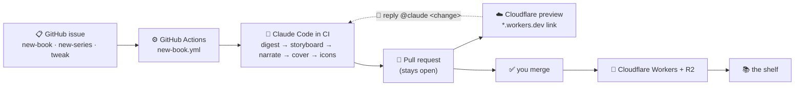

<h1 align="center">orly 📚</h1>

<p align="center"><a href="README.md">English</a> · 简体中文 · <a href="README.ja.md">日本語</a></p>

<p align="center">
  <em>一个会自行构建的生成式解说书架。</em><br/>
  将 Claude Code 指向任意 GitHub 仓库及其中一个子系统，它就会编写一本带旁白和动画的
  <strong>O'RLY 仿作</strong>“书籍”，然后将它发布到书架。
</p>

<p align="center">
  <a href="https://github.com/BLamy/orly/actions/workflows/deploy.yml"></a>
  <a href="https://orly.brett-lamy.workers.dev/"></a>
  <a href="https://claude.com/claude-code"></a>
  <a href="LICENSE"></a>
</p>

<p align="center">
  <a href="https://orly.brett-lamy.workers.dev/?bundle=the-orly-loop">
    
  </a>
</p>

> ### ▶ 观看解说本仓库的解说视频
> **[ORLY Loop →](https://orly.brett-lamy.workers.dev/?bundle=the-orly-loop)** — 这是书架生成的一本介绍自身的书：创建 Issue → Claude Code 构建书籍 → 创建预览 PR → 使用 `@claude` 调整 → 合并 → 正式上线。观看它是了解本项目最快的方式。

**在线书架：** **https://orly.brett-lamy.workers.dev/**

---

## 什么是“书籍”？

每本书都是对某个代码库子系统的带旁白、动画的**数据流解说**：

- 多章节的 **D3 幻灯片**——节点和边随时间逐步出现，消息包以动画形式移动，镜头为每一步取景。
- ElevenLabs 提供的**旁白**，通过精确到字符的 TTS 时间戳使幻灯片与音频同步。
- **O'RLY 仿作封面**——由 `gpt-image` 生成的木刻风动物（通过拒绝文字的 QA 循环检查），在浏览器中与标题和作者合成，并以倾斜角度贴到书架上的 3D 书籍上。
- **以真实代码为依据**——故事板步骤引用真实文件和函数；不会虚构任何内容。

目前书架上有 **8 本书**，其中包括完整的 *Effect.ts — The Good Parts* 系列。

## 循环如何运作

添加书籍时完全不需要编辑文件。你只需**创建一个 Issue**，CI 会完成其余工作：



1. 使用模板创建一个 Issue（📕 新书、📚 新系列、✏️ 调整）。任何人都可以提交，但流程只会为仓库所有者运行——由所有者创建 Issue，或添加 `build` 标签时才会运行。重新添加标签可以再次运行。
2. **Claude Code 在 CI 中运行**，遵循 [`.claude/commands/`](.claude/commands) 中相应的操作手册，并端到端运行生成器。
3. 系统会创建一个**保持开放的拉取请求**，并直接在其中评论一个**可用的 Cloudflare 预览**。
4. 在 PR 中回复 **`@claude <change>`** 即可修改书籍——它会编辑分支、推送更改并重新部署预览。可以按需重复任意次数。
5. **由你执行合并**——这是唯一有意保留的手动步骤——随后项目会部署到 **Cloudflare Workers**。

## 分叉并运行你自己的版本

分叉此仓库，添加少量密钥，同一套循环就能构建属于你的书籍集合。

| 密钥 | 作用 | 获取方式 |
| --- | --- | --- |
| `CLAUDE_CODE_OAUTH_TOKEN` | 在 CI 中运行 Claude Code——**费用计入你的 Claude 订阅**，而不是按调用计费的 API 密钥 | 运行 **`claude setup-token`** |
| `CLOUDFLARE_API_TOKEN` + `CLOUDFLARE_ACCOUNT_ID` | 生产部署和每个 PR 的预览 | Cloudflare 控制面板 → “Edit Cloudflare Workers”令牌 |
| `OPENAI_API_KEY` | `gpt-image` 封面图片 | platform.openai.com |
| `ELEVENLABS_API_KEY` | 旁白文本转语音 | elevenlabs.io |
| `NOUN_PROJECT_KEY` + `NOUN_PROJECT_SECRET` | 图表节点和消息包的图标 | thenounproject.com/developers |

然后在你的分叉中创建一个 **📕 New book** Issue，等待预览 PR 出现即可。

> **托管方式：** 书架是一个静态资源 **Cloudflare Worker**（`wrangler.jsonc`），从域名根路径提供服务。`deploy.yml` 将 `main` 部署到生产环境；`preview.yml` 将每个书籍 PR 部署为 `*.workers.dev` 预览。（媒体文件——MP3 和封面——目前随项目一起打包；未来计划改用 **R2** 对象存储提供服务。）

## 在本地制作书籍

除了 Issue 流程，也可以在本机直接运行生成器：

```bash
npm install            # also installs the git pre-commit hooks
npm run dev            # http://localhost:5173/  (the shelf)

# generate a book (or run /new-book inside Claude Code):
npm run explain -- --repo https://github.com/koajs/koa \
                   --prompt "how a request flows through the middleware onion" \
                   --title "Koa.js" --open
```

密钥保存在已被 git 忽略的 `.env` 中（`OPENAI_API_KEY`、`ELEVENLABS_API_KEY`、`NOUN_PROJECT_KEY/SECRET`）。故事板由 Claude Code 编写，因此不需要 Anthropic API 密钥。完整流程请参阅 [`generator/README.md`](generator/README.md)，操作手册请参阅 [`.claude/commands/`](.claude/commands)。

## 架构

```
generator/   the pipeline (npm run explain)
  repo.mjs · storyboard.mjs · validate.mjs (layered layout) · tts.mjs (ElevenLabs)
  cover.mjs + seeds.mjs (gpt-image + vision QA) · noun.mjs + iconize.mjs · transform.mjs
src/         the Vite + React app
  library/   the iBooks-style shelf (canvas 3-D books)
  engine/    the D3 slideshow (audio-synced, icon-aware)
public/generated/<slug>/   each book's manifest.json + audio/ + animal.png
  library.json             the shelf registry
.github/workflows/         deploy · new-book · preview · comment-edit · test-pipeline
```

**技术：** Vite · React · D3 · Framer Motion · Cloudflare Workers · ElevenLabs · OpenAI `gpt-image` · The Noun Project · GitHub Actions · Claude Code。

## 致谢与免责声明

图标来自 [The Noun Project](https://thenounproject.com)（CC BY）。封面是 **“O'RLY?”仿作**——本项目与 **O'Reilly Media 没有关联，也未获得其认可**，并且绝不会呈现真实出版商的名称。

使用 [Claude Code](https://claude.com/claude-code) 和 GitHub Actions 工作流构建。

## 许可证

[MIT](LICENSE) © Brett Lamy
